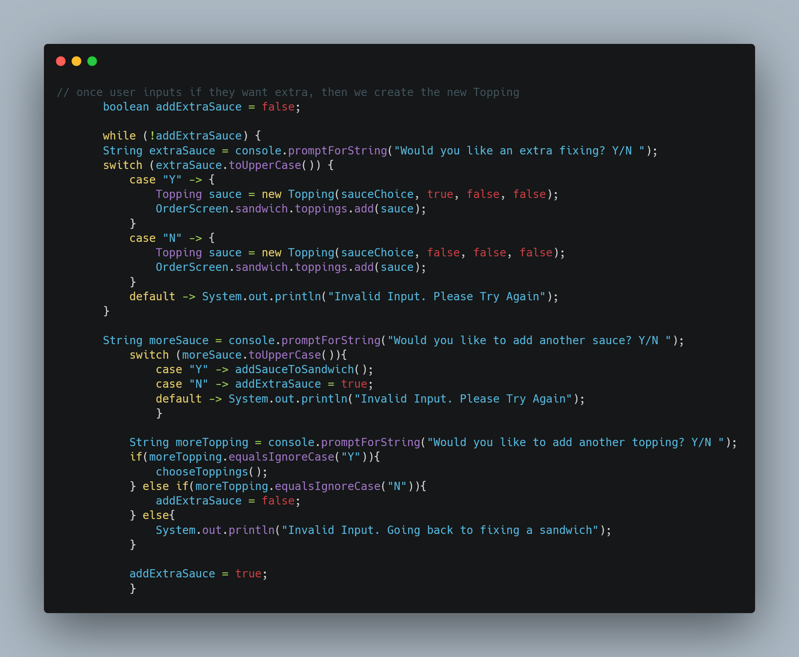

# 🥪 How To Fix-Me-A-Sandwich Online

A modern point-of-sale application that digitizes the sandwich ordering process, built with Java and object-oriented design principles.

## 📋 Overview

This project transforms traditional sandwich shop operations by replacing paper orders and manual processes with an intuitive digital ordering system. 
Customers can build custom sandwiches while the system handles pricing, order management, and workflow automation.

## ✨ Features

* **🥖 Custom Sandwich Builder**: Interactive interface for selecting bread, meats, cheeses, and toppings
* **💰 Automated Pricing**: Real-time price calculations based on selections
* **📝 Order Management**: Complete workflow from order creation to completion
* **📊 Inventory Tracking**: Monitor ingredient availability and usage

## 🔧 Technical Highlights

Built using object-oriented programming principles with modular, reusable components:

* Clean separation of concerns through class-based architecture
* Extensible design for easy feature additions
* Maintainable codebase with clear interfaces and abstractions

## 💻 Technologies Used

* ☕ Java
* 🏗️ Object-Oriented Design
* 🖥️ Console-based user interface

## 🚀 Getting Started

```bash
# Clone the repository
git clone [repository-url]

# Navigate to project directory
cd sandwich-shop-pos

# Compile and run
javac *.java
java Main
```

## 🏗️ Architecture

This class relationship diagram served as the architectural blueprint throughout the development process, 
guiding the implementation from initial concept to final solution. The diagram illustrates how each component interacts within the system, 
showcasing the object-oriented relationships that make the application both maintainable and scalable.

## 📸 Code Implementation

Below are key code snippets that demonstrate the core functionality and object-oriented design principles used in this application:

### Main Application Entry Point


#### 🍽️ Welcome & Entry Menu Design
The application opens with a warm welcome to our deli, immediately setting the tone for a friendly, engaging experience. 
We begin by introducing customers to "Fix-Me-A-Sandwich" and then dive straight into what we do best - making sandwiches!

**Menu Flow:**
1. **Deli Introduction** - A welcoming message that establishes the brand personality
2. **Direct Sandwich Prompt** - Since we're a deli, we get right to the point: "Would you like a sandwich?"
3. **Size Selection Options:**
    - 🥪 **4 inch** - Perfect for a light bite
    - 🥪 **8 inch** - The classic choice
    - 🥪 **12 inch** - For those big appetites
    - ⭐ **Signature Sandwich** - Our chef's special creations

**Engaging User Experience:**
The menu incorporates playful wordplay that ties back to our deli name "Fix-Me-A-Sandwich," creating memorable interactions that make ordering feel less transactional and more conversational. 
This approach helps establish a connection with customers right from the start, setting expectations for a personalized, friendly service experience.

### Code Highlights to Showcase:


## 🌍 Project Goals

This application demonstrates practical software development skills by solving real business challenges through thoughtful design. 
The modular architecture makes it easy to extend functionality, such as adding new sandwich types, payment methods, or reporting features.